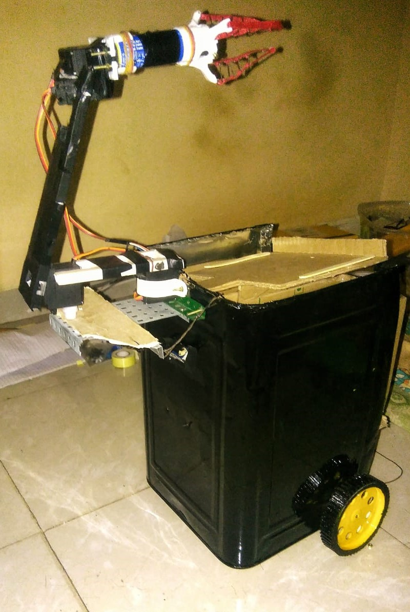

# Automatic Waste Segregator 
     

	In today's world, it is important that waste items are treated properly before they are dumped into landfills for decomposition. For efficient decomposition, proper segregation needs to take place. Current waste management practices involve sorting the waste materials in the central facility. If the sorting procedure takes place at the source of garbage production, then their efficiency will increase a lot. However, relying on human beings to segregate their waste items does not work well in the long run as human beings are lazy and become complacent with time. Therefore, an automatic solution is proposed that can perform the task of segregation with great accuracy, without human assistance.  
	Automatic Waste Segregator is a portable waste segregator system that identifies and separates waste materials into biodegradable and non-biodegradable categories. It uses Machine Learning to identify the type of waste. The entire system is operated using Raspberry Pi 3 developement board. Additional feature of remote monitoring is also possible. The sys admin can monitor multiple devices and the type of waste processed by them in real-time, using a web application. 
	  
	The following subsystems are used:
	  
	&emsp;&emsp;&emsp;&emsp;&emsp;&emsp;&emsp;&emsp;&emsp;&emsp;&emsp;
	

 

## Dependency

##### Hardware Requirements:

- Raspberry Pi 3B.
- Pi Camera.
- PCA9685 servo motor driver.
- MG995 servo motor.
- IR sensors x2.
- 16x2 LCD display module.
- Power supply - 5V,2A.

##### Software Requirements:

- Python 3.
- Python Dependencies:
    - Rpi.GPIO
	- picamera library.
	- OpenCV.
	- Flask.
	- multiprocessing, multithreading.
	- google-cloud.
	- time.
	- os.
	- socket
- Twilio SMS API.
- Google Cloud VM.
- Tensorflow for Poets.

 

## Releases

There are 2 versions of the system: 

<table align="center">
	<tr>
		<td></td>
		<td width="600px">
			<a href="#">&emsp;&emsp;Version 1</a>  
			<ul>
				 Segreagtes waste into 2 categories. 
				 Provides Live monitoring via Web Application. 
				 User Notification via SMS.
			</ul>
		</td>
	</tr>
	<tr>
		<td></td>
		<td width="600px">
			<a href="#">&emsp;&emsp;Version 2</a>  
			<ul>
				 Segreagtes waste into 2 categories. 
				 Robotic arm that picks up waste by itself. 
				 Wheels that move the device in a set path.
			</ul>
		</td>
	</tr>
</table>