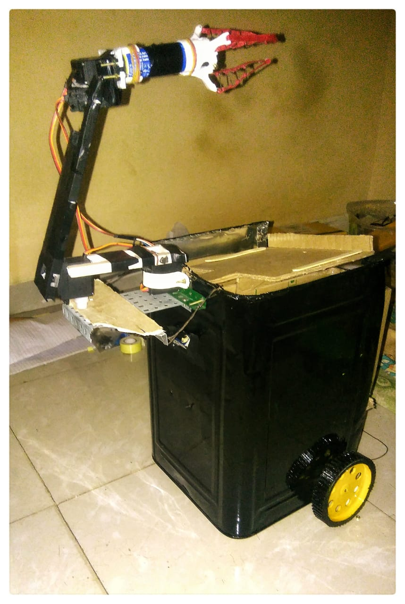

# Version 0.1  &emsp;&emsp;&emsp;&emsp;&emsp;&emsp;&emsp;&emsp;&emsp;&emsp;&emsp;&emsp;&emsp; [](https://github.com/boudhayan-dev/Automatic-Waste-Segregator) [](https://github.com/boudhayan-dev/Automatic-Waste-Segregator/tree/v.02)

This version consists of a dustbin that is supported by a robotic arm and wheels. The wheels are used to move the device across a given path. The camera mounted at the front of the device checks for the presence of any object in the front. The robotic arm pics up the object if it is present and places it on the lid. The device then perfoms identification of the object and deposits it in either of the smaller bins inside the device. The path of the device can be re-programmmed using Bluetooth companion app.
<br><br>

### System

<table>
	<tr>
		<td width="500px">
			&emsp;&emsp;&emsp;&emsp;&emsp;
			<h6>&emsp;&emsp;&emsp;&emsp;&emsp;&emsp;&emsp;System front view</h6>
		</td>
		<td width="500px">
			&emsp;&emsp;&emsp;&emsp;&emsp;
			<h6>&emsp;&emsp;&emsp;&emsp;&emsp;&emsp;&emsp;&emsp;&emsp;System side view</h6>
		</td>
	</tr>
</table>

<br>

### Usage

<h6>Clone the repository.</h6>

```
git clone https://github.com/boudhayan-dev/Automatic-Waste-Segregator
cd Automatic-Waste-Segregator
git checkout v.01
cd Segregator\ v.1
```

<h6>Server side.</h6>


- Start the Server side script for Machine Learning as follows :

```
python server.py
```

This should start the Server side script that listens on port <code>60000</code> for any incoming connections.
<br><br>
<h6>Client side.</h6> 

- Start the client side script on Raspberry Pi as follows -

```
python client-thread.py
```
Choose the appropriate mode shown in the prompt.
The device should takes approx 10 seconds to start up. The device will travel in the predetermined path. If new path has to be selected, then the corresponding mode should be selected.

<br>

### Demonstration

The working video of the system :<br>

&emsp;&emsp;&emsp;&emsp;&emsp;&emsp;<a href="https://www.youtube.com/watch?v=7YgnJELpMyE"></a>\

<br>
© All rights reserved.