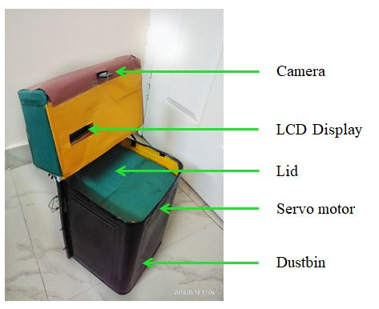
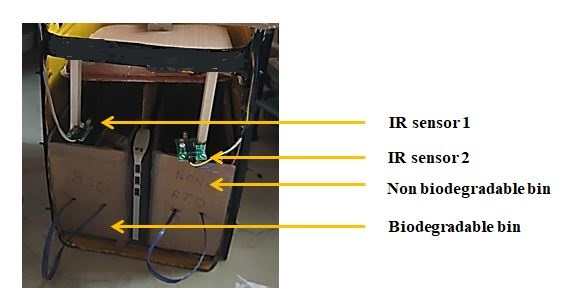
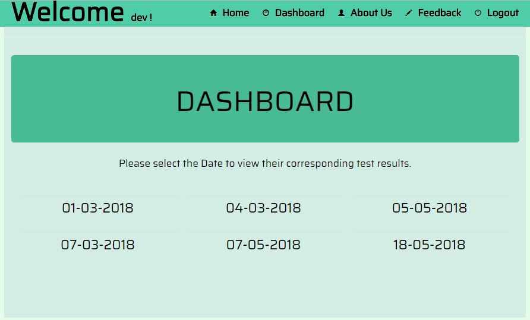
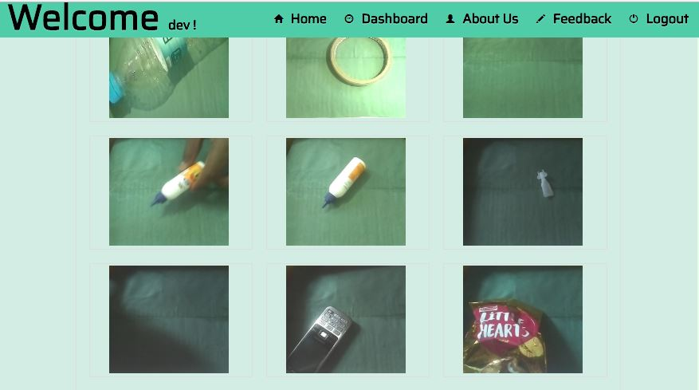
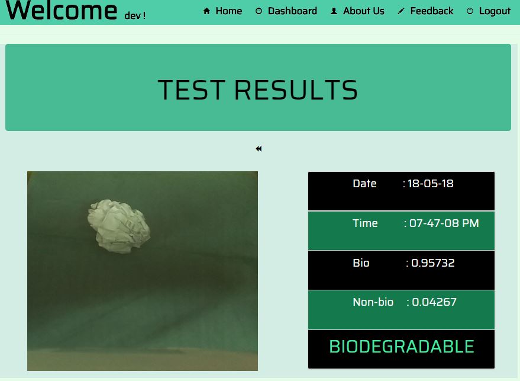
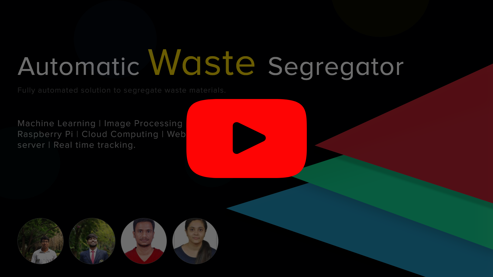

# Version 0.2  &emsp;&emsp;&emsp;&emsp;&emsp;&emsp;&emsp;&emsp;&emsp;&emsp;&emsp;&emsp;&emsp; [](https://github.com/boudhayan-dev/Automatic-Waste-Segregator) [](https://github.com/boudhayan-dev/Automatic-Waste-Segregator/tree/v.02)

This version consists of a dustbin that is partitioned centrally to accomodate two smaller bins inside of it. The bins correspond to either category of waste. The user has to manually drop the waste onto the lid. The detection of the waste item on the lid is performed automatically by the camera mounted at the top of the bin. The identification of the waste item is carried out in Cloud and the information is relayed back to the device which ultimately tilts the flap to deposit the waste into either bins. This entire operation can be monitored online by the system admin.
<br><br>

### System

<table>
	<tr>
		<td>
			
			<h6>&emsp;&emsp;&emsp;&emsp;&emsp;&emsp;&emsp;System front view</h6>
		</td>
		<td>
			
			<h6>&emsp;&emsp;&emsp;&emsp;&emsp;&emsp;&emsp;&emsp;&emsp;System back view</h6>
		</td>
	</tr>
	<tr>
		<td>
			
			<h6>&emsp;&emsp;&emsp;&emsp;&emsp;&emsp;&emsp;Web Application Dashboard</h6>
		</td>
		<td>
			
			<h6>&emsp;&emsp;&emsp;&emsp;&emsp;&emsp;&emsp;Web Application Dashboard</h6>
		</td>
	</tr>
	<tr>
		<td>
			
			<h6>&emsp;&emsp;&emsp;&emsp;&emsp;&emsp;&emsp;Web Application Dashboard</h6>
		</td>
	</tr>
</table>

<br><br>

### Usage

<h6>Clone the repository.</h6>

```
git clone https://github.com/boudhayan-dev/Automatic-Waste-Segregator
cd Automatic-Waste-Segregator
git checkout v.02
cd Segregator v.2
```

<h6>Server side.</h6>

- Start the Flask Web Application as follows :

```
cd server\webapp
set FLASK_APP=run.py
flask run
```

This should start the web application on port <code>5050</code>.
Navigate to url : <code>http://http://127.0.0.1:5000/</code> to view the web application.

- Start the Server side script for Machine Learning as follows :

```
cd server\webapp\app
python newServer.py
```

This should start the Server side script that listens on port <code>60000</code> for any incoming connections.
<br><br>
<h6>Client side.</h6> 

- Start the client side script on Raspberry Pi as follows -

```
cd client
python client.py
```

The device should takes approx 10 seconds to start up. Place any object on its lid, to see the corresponding results.

<br><br>

### Demonstration

The working video of the system :<br>

<a href="https://www.youtube.com/watch?v=UH9mXYVWXmw"></a>